# PAMITeensy Robot Control System Architecture

## Overview

PAMITeensy is a sophisticated robot control system designed for Teensy microcontrollers. It provides a complete framework for differential drive robot control with advanced motion planning, position tracking, and multi-threaded task management.

## System Architecture Overview

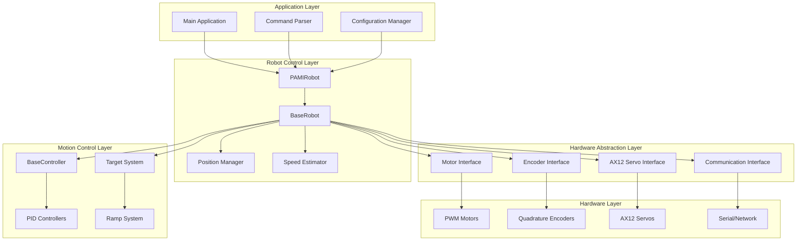
```mermaid
graph TB
    subgraph "Application Layer"
        A[Main Application]
        B[Command Parser]
        C[Configuration Manager]
    end
    
    subgraph "Robot Control Layer"
        D[PAMIRobot]
        E[BaseRobot]
        F[Position Manager]
        G[Speed Estimator]
    end
    
    subgraph "Motion Control Layer"
        H[BaseController]
        I[PID Controllers]
        J[Target System]
        K[Ramp System]
    end
    
    subgraph "Hardware Abstraction Layer"
        L[Motor Interface]
        M[Encoder Interface]
        N[AX12 Servo Interface]
        O[Communication Interface]
    end
    
    subgraph "Hardware Layer"
        P[PWM Motors]
        Q[Quadrature Encoders]
        R[AX12 Servos]
        S[Serial/Network]
    end
    
    A --> D
    B --> D
    C --> D
    D --> E
    E --> F
    E --> G
    E --> H
    H --> I
    E --> J
    J --> K
    E --> L
    E --> M
    E --> N
    E --> O
    L --> P
    M --> Q
    N --> R
    O --> S
```

## Core Class Hierarchy

### Robot Control Hierarchy

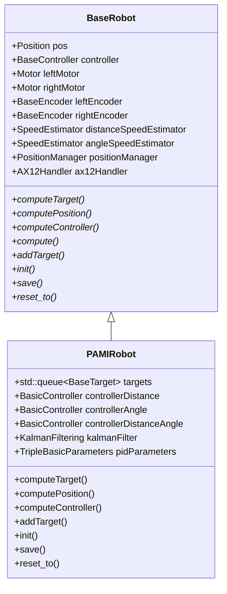
```mermaid
classDiagram
    class BaseRobot {
        +Position pos
        +BaseController controller
        +Motor leftMotor
        +Motor rightMotor
        +BaseEncoder leftEncoder
        +BaseEncoder rightEncoder
        +SpeedEstimator distanceSpeedEstimator
        +SpeedEstimator angleSpeedEstimator
        +PositionManager positionManager
        +AX12Handler ax12Handler
        +computeTarget()*
        +computePosition()*
        +computeController()*
        +compute()*
        +addTarget()*
        +init()*
        +save()*
        +reset_to()*
    }
    
    class PAMIRobot {
        +std::queue~BaseTarget~ targets
        +BasicController controllerDistance
        +BasicController controllerAngle
        +BasicController controllerDistanceAngle
        +KalmanFiltering kalmanFilter
        +TripleBasicParameters pidParameters
        +computeTarget()
        +computePosition()
        +computeController()
        +addTarget()
        +init()
        +save()
        +reset_to()
    }
    
    BaseRobot <|-- PAMIRobot
```

### Controller Hierarchy

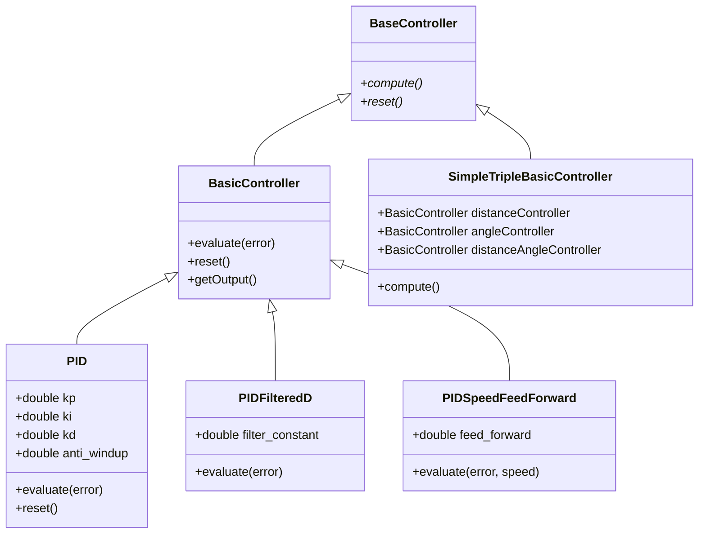
```mermaid
classDiagram
    class BaseController {
        +compute()*
        +reset()*
    }
    
    class BasicController {
        +evaluate(error)
        +reset()
        +getOutput()
    }
    
    class PID {
        +double kp
        +double ki
        +double kd
        +double anti_windup
        +evaluate(error)
        +reset()
    }
    
    class PIDFilteredD {
        +double filter_constant
        +evaluate(error)
    }
    
    class PIDSpeedFeedForward {
        +double feed_forward
        +evaluate(error, speed)
    }
    
    class SimpleTripleBasicController {
        +BasicController distanceController
        +BasicController angleController
        +BasicController distanceAngleController
        +compute()
    }
    
    BaseController <|-- BasicController
    BasicController <|-- PID
    BasicController <|-- PIDFilteredD
    BasicController <|-- PIDSpeedFeedForward
    BaseController <|-- SimpleTripleBasicController
```

### Target System Hierarchy

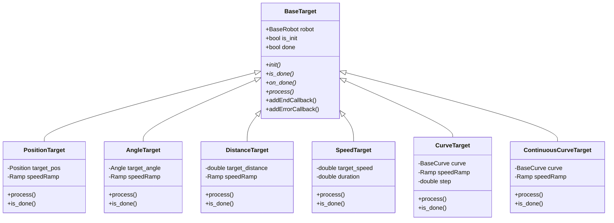
```mermaid
classDiagram
    class BaseTarget {
        +BaseRobot robot
        +bool is_init
        +bool done
        +init()*
        +is_done()*
        +on_done()*
        +process()*
        +addEndCallback()
        +addErrorCallback()
    }
    
    class PositionTarget {
        -Position target_pos
        -Ramp speedRamp
        +process()
        +is_done()
    }
    
    class AngleTarget {
        -Angle target_angle
        -Ramp speedRamp
        +process()
        +is_done()
    }
    
    class DistanceTarget {
        -double target_distance
        -Ramp speedRamp
        +process()
        +is_done()
    }
    
    class SpeedTarget {
        -double target_speed
        -double duration
        +process()
        +is_done()
    }
    
    class CurveTarget {
        -BaseCurve curve
        -Ramp speedRamp
        -double step
        +process()
        +is_done()
    }
    
    class ContinuousCurveTarget {
        -BaseCurve curve
        -Ramp speedRamp
        +process()
        +is_done()
    }
    
    BaseTarget <|-- PositionTarget
    BaseTarget <|-- AngleTarget
    BaseTarget <|-- DistanceTarget
    BaseTarget <|-- SpeedTarget
    BaseTarget <|-- CurveTarget
    BaseTarget <|-- ContinuousCurveTarget
```

### Ramp System Hierarchy

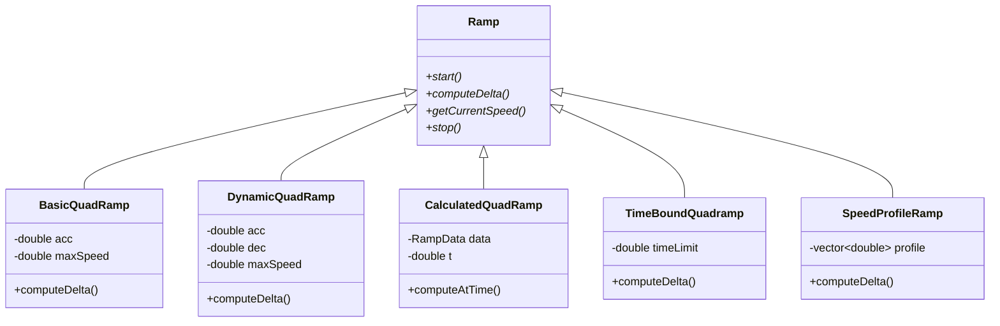
```mermaid
classDiagram
    class Ramp {
        +start()*
        +computeDelta()*
        +getCurrentSpeed()*
        +stop()*
    }
    
    class BasicQuadRamp {
        -double acc
        -double maxSpeed
        +computeDelta()
    }
    
    class DynamicQuadRamp {
        -double acc
        -double dec
        -double maxSpeed
        +computeDelta()
    }
    
    class CalculatedQuadRamp {
        -RampData data
        -double t
        +computeAtTime()
    }
    
    class TimeBoundQuadramp {
        -double timeLimit
        +computeDelta()
    }
    
    class SpeedProfileRamp {
        -vector~double~ profile
        +computeDelta()
    }
    
    Ramp <|-- BasicQuadRamp
    Ramp <|-- DynamicQuadRamp
    Ramp <|-- CalculatedQuadRamp
    Ramp <|-- TimeBoundQuadramp
    Ramp <|-- SpeedProfileRamp
```

### Hardware Interface Hierarchy

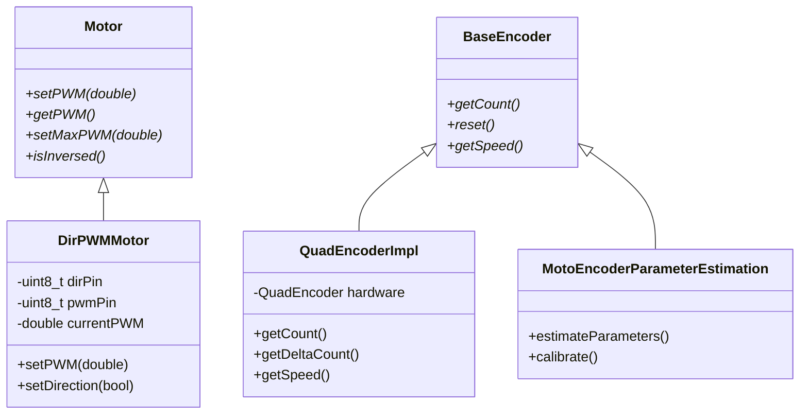
```mermaid
classDiagram
    class Motor {
        +setPWM(double)*
        +getPWM()*
        +setMaxPWM(double)*
        +isInversed()*
    }
    
    class DirPWMMotor {
        -uint8_t dirPin
        -uint8_t pwmPin
        -double currentPWM
        +setPWM(double)
        +setDirection(bool)
    }
    
    class BaseEncoder {
        +getCount()*
        +reset()*
        +getSpeed()*
    }
    
    class QuadEncoderImpl {
        -QuadEncoder hardware
        +getCount()
        +getDeltaCount()
        +getSpeed()
    }
    
    class MotoEncoderParameterEstimation {
        +estimateParameters()
        +calibrate()
    }
    
    Motor <|-- DirPWMMotor
    BaseEncoder <|-- QuadEncoderImpl
    BaseEncoder <|-- MotoEncoderParameterEstimation
```

## System Components and Interactions

### Main Control Loop Flow

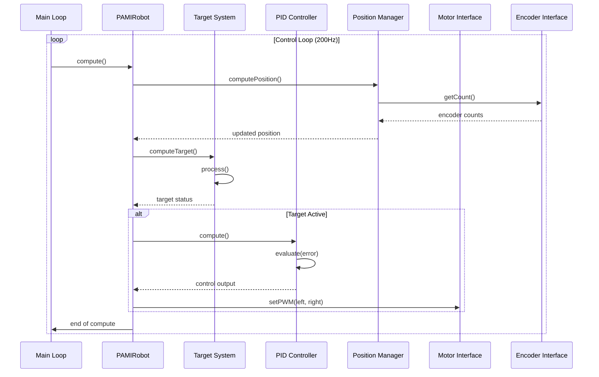
```mermaid
sequenceDiagram
    participant Main as Main Loop
    participant Robot as PAMIRobot
    participant Target as Target System
    participant Controller as PID Controller
    participant Position as Position Manager
    participant Motors as Motor Interface
    participant Encoders as Encoder Interface
    
    loop Control Loop (200Hz)
        Main->>Robot: compute()
        Robot->>Position: computePosition()
        Position->>Encoders: getCount()
        Encoders-->>Position: encoder counts
        Position-->>Robot: updated position
        
        Robot->>Target: computeTarget()
        Target->>Target: process()
        Target-->>Robot: target status
        
        alt Target Active
            Robot->>Controller: compute()
            Controller->>Controller: evaluate(error)
            Controller-->>Robot: control output
            Robot->>Motors: setPWM(left, right)
        end
        
        Robot->>Main: end of compute
    end
```

### Target Processing State Machine

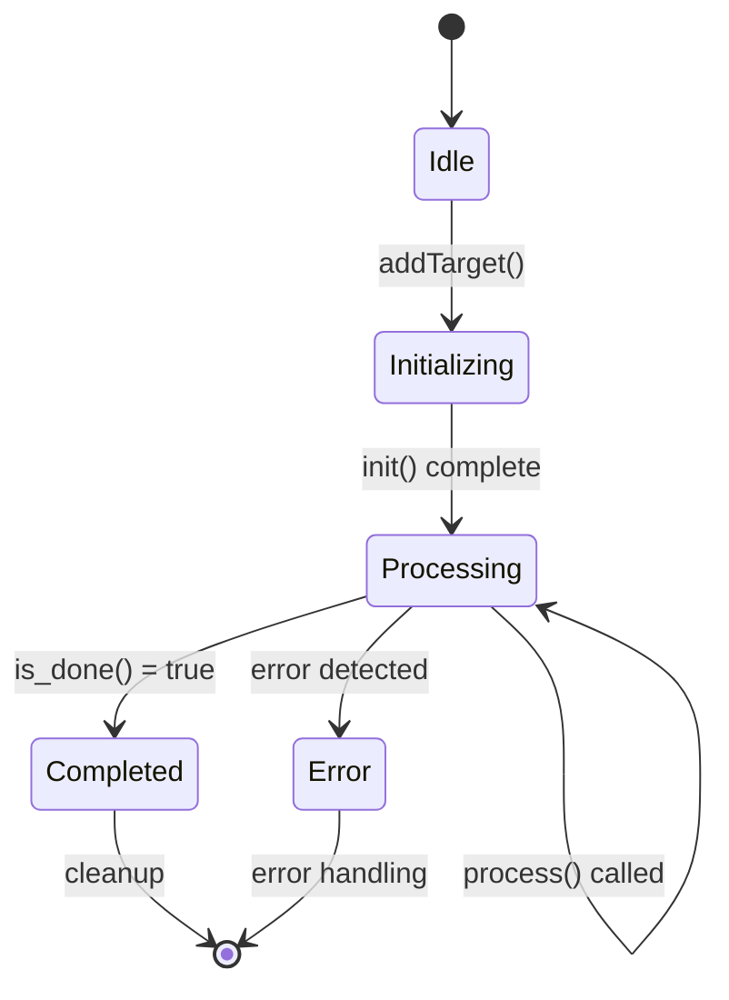
```mermaid
stateDiagram-v2
    [*] --> Idle
    Idle --> Initializing : addTarget()
    Initializing --> Processing : init() complete
    Processing --> Completed : is_done() = true
    Processing --> Error : error detected
    Completed --> [*] : cleanup
    Error --> [*] : error handling
    Processing --> Processing : process() called
```

### Position Tracking System

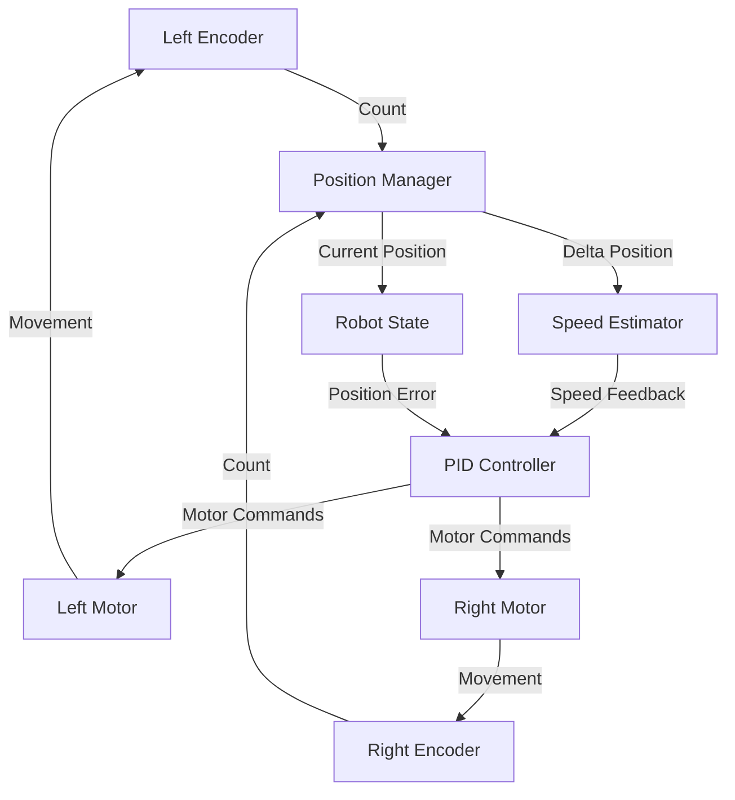
```mermaid
graph TD
    A[Left Encoder] -->|Count| B[Position Manager]
    C[Right Encoder] -->|Count| B
    B -->|Delta Position| D[Speed Estimator]
    B -->|Current Position| E[Robot State]
    D -->|Speed Feedback| F[PID Controller]
    E -->|Position Error| F
    F -->|Motor Commands| G[Left Motor]
    F -->|Motor Commands| H[Right Motor]
    G -->|Movement| A
    H -->|Movement| C
```

### Task Management System

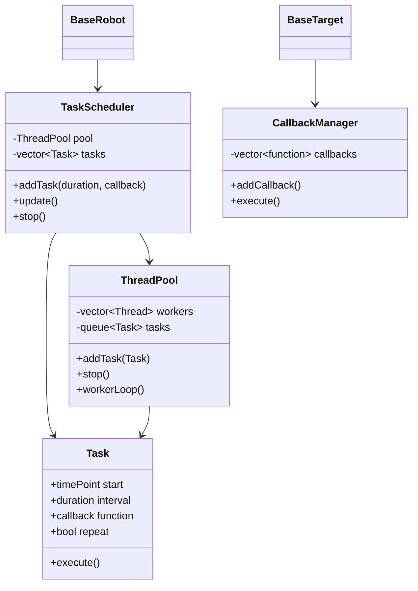
```mermaid
classDiagram
    class TaskScheduler {
        -ThreadPool pool
        -vector~Task~ tasks
        +addTask(duration, callback)
        +update()
        +stop()
    }
    
    class ThreadPool {
        -vector~Thread~ workers
        -queue~Task~ tasks
        +addTask(Task)
        +stop()
        +workerLoop()
    }
    
    class Task {
        +timePoint start
        +duration interval
        +callback function
        +bool repeat
        +execute()
    }
    
    class CallbackManager {
        -vector~function~ callbacks
        +addCallback()
        +execute()
    }
    
    TaskScheduler --> ThreadPool
    TaskScheduler --> Task
    ThreadPool --> Task
    BaseRobot --> TaskScheduler
    BaseTarget --> CallbackManager
```

## Communication Architecture

### Network Communication

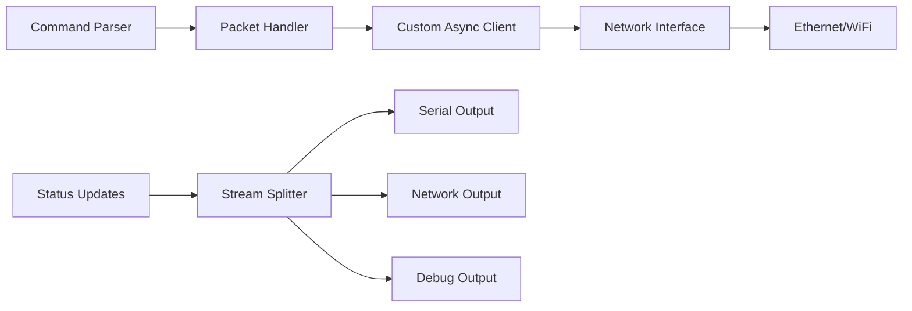
```mermaid
graph LR
    A[Command Parser] --> B[Packet Handler]
    B --> C[Custom Async Client]
    C --> D[Network Interface]
    D --> E[Ethernet/WiFi]
    
    F[Status Updates] --> G[Stream Splitter]
    G --> H[Serial Output]
    G --> I[Network Output]
    G --> J[Debug Output]
```

### Packet Handling System

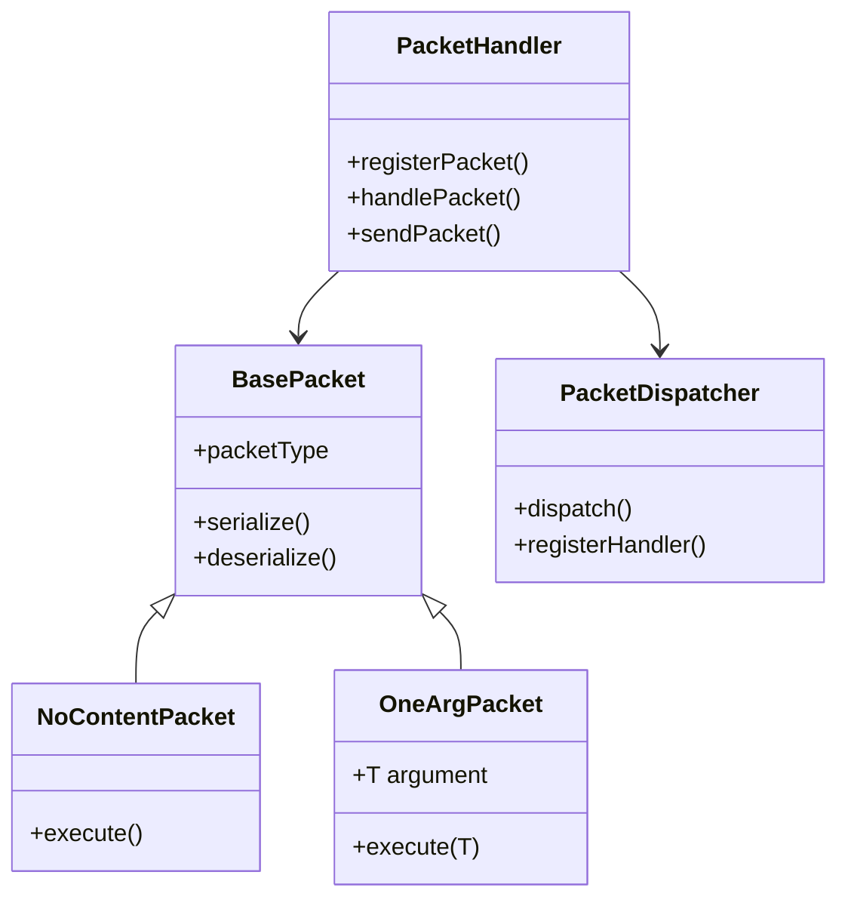
```mermaid
classDiagram
    class PacketHandler {
        +registerPacket()
        +handlePacket()
        +sendPacket()
    }
    
    class BasePacket {
        +packetType
        +serialize()
        +deserialize()
    }
    
    class NoContentPacket {
        +execute()
    }
    
    class OneArgPacket {
        +T argument
        +execute(T)
    }
    
    class PacketDispatcher {
        +dispatch()
        +registerHandler()
    }
    
    PacketHandler --> BasePacket
    PacketHandler --> PacketDispatcher
    BasePacket <|-- NoContentPacket
    BasePacket <|-- OneArgPacket
```

## Configuration Management

### Configuration Structure

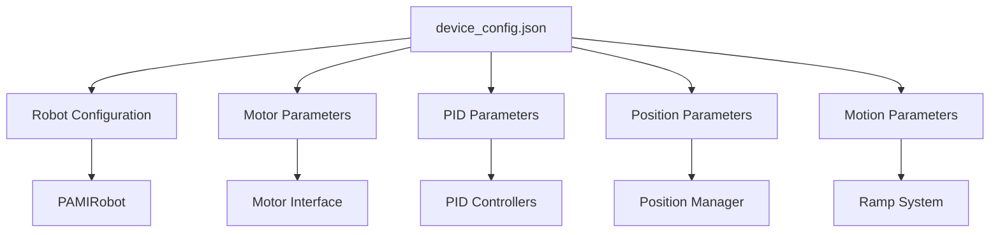
```mermaid
graph TD
    A[device_config.json] --> B[Robot Configuration]
    A --> C[Motor Parameters]
    A --> D[PID Parameters]
    A --> E[Position Parameters]
    A --> F[Motion Parameters]
    
    B --> G[PAMIRobot]
    C --> H[Motor Interface]
    D --> I[PID Controllers]
    E --> J[Position Manager]
    F --> K[Ramp System]
```

### Configuration Loading Flow

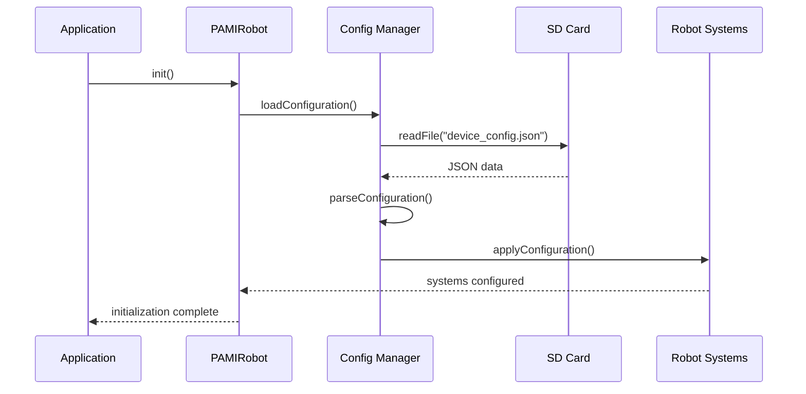
```mermaid
sequenceDiagram
    participant App as Application
    participant Robot as PAMIRobot
    participant Config as Config Manager
    participant SD as SD Card
    participant Systems as Robot Systems
    
    App->>Robot: init()
    Robot->>Config: loadConfiguration()
    Config->>SD: readFile("device_config.json")
    SD-->>Config: JSON data
    Config->>Config: parseConfiguration()
    Config->>Systems: applyConfiguration()
    Systems-->>Robot: systems configured
    Robot-->>App: initialization complete
```

## Calibration System

### Calibration Flow

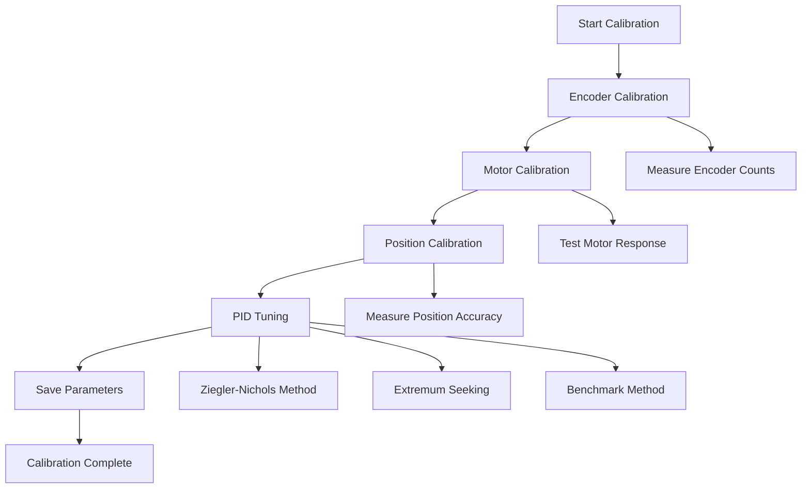
```mermaid
graph TD
    A[Start Calibration] --> B[Encoder Calibration]
    B --> C[Motor Calibration]
    C --> D[Position Calibration]
    D --> E[PID Tuning]
    E --> F[Save Parameters]
    F --> G[Calibration Complete]
    
    B --> B1[Measure Encoder Counts]
    C --> C1[Test Motor Response]
    D --> D1[Measure Position Accuracy]
    E --> E1[Ziegler-Nichols Method]
    E --> E2[Extremum Seeking]
    E --> E3[Benchmark Method]
```

## Error Handling and Safety

### Error Handling Architecture

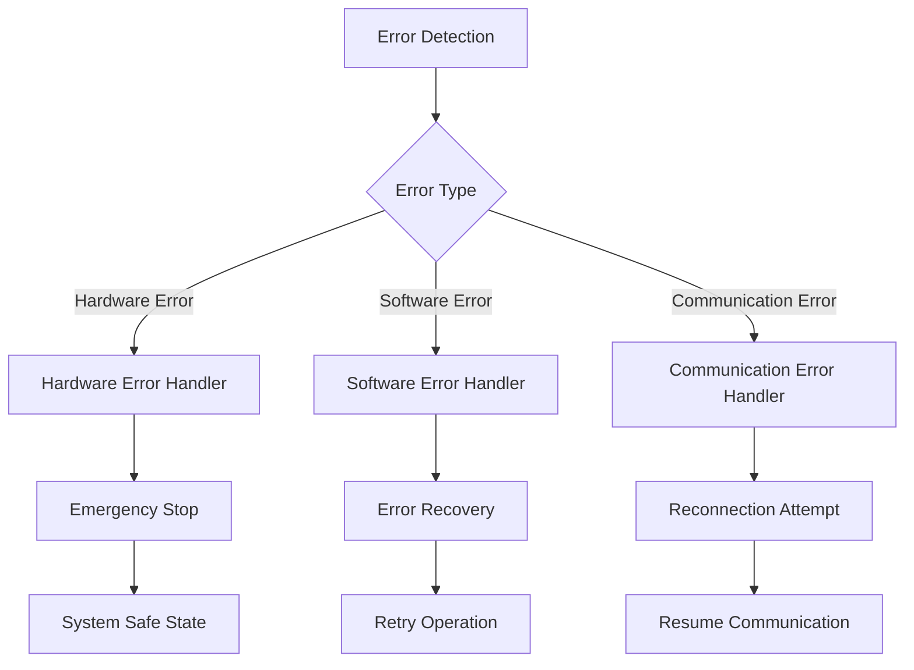
```mermaid
graph TD
    A[Error Detection] --> B{Error Type}
    B -->|Hardware Error| C[Hardware Error Handler]
    B -->|Software Error| D[Software Error Handler]
    B -->|Communication Error| E[Communication Error Handler]
    
    C --> F[Emergency Stop]
    D --> G[Error Recovery]
    E --> H[Reconnection Attempt]
    
    F --> I[System Safe State]
    G --> J[Retry Operation]
    H --> K[Resume Communication]
```

### Safety Features

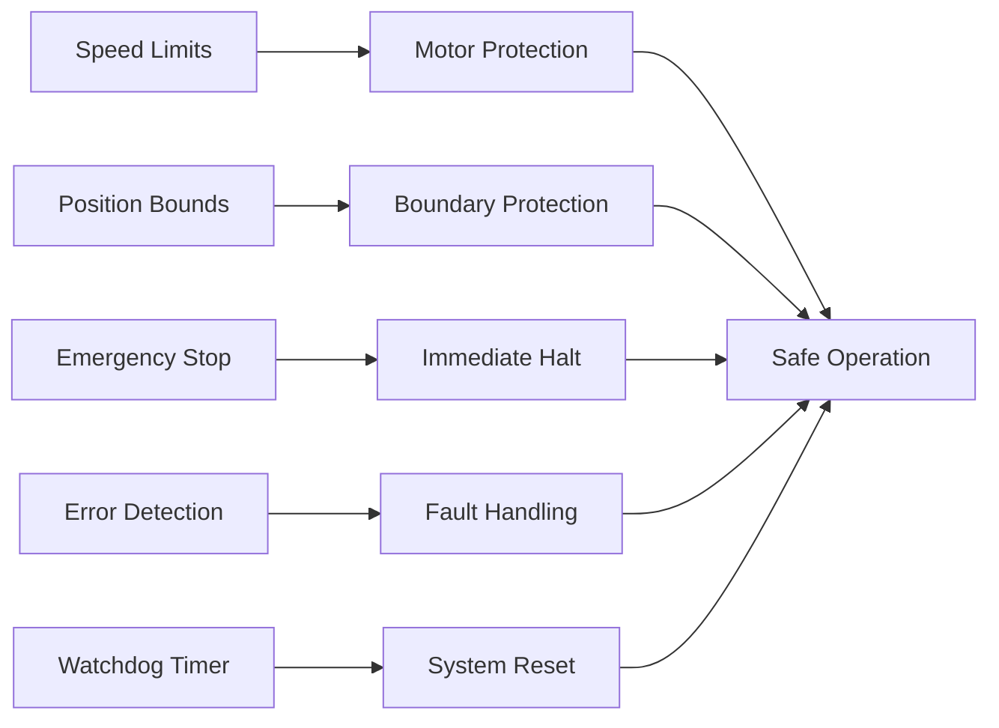
```mermaid
graph LR
    A[Speed Limits] --> B[Motor Protection]
    C[Position Bounds] --> D[Boundary Protection]
    E[Emergency Stop] --> F[Immediate Halt]
    G[Error Detection] --> H[Fault Handling]
    I[Watchdog Timer] --> J[System Reset]
    
    B --> K[Safe Operation]
    D --> K
    F --> K
    H --> K
    J --> K
```

## Performance Characteristics

### Timing Analysis

```mermaid
gantt
    title Control Loop Timing
    dateFormat X
    axisFormat %L
    
    section Control Loop
    Position Update    :0, 2
    Target Processing  :2, 3
    PID Computation    :3, 4
    Motor Update       :4, 5
    section Total: 5ms (200Hz)
```

### Resource Usage

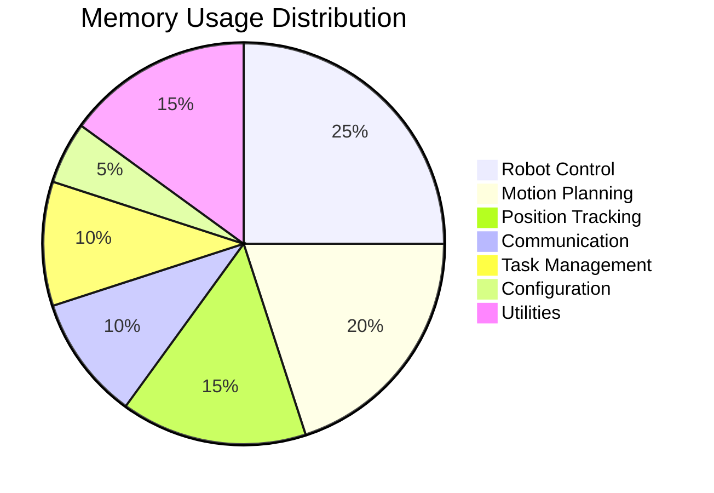
```mermaid
pie title Memory Usage Distribution
    "Robot Control" : 25
    "Motion Planning" : 20
    "Position Tracking" : 15
    "Communication" : 10
    "Task Management" : 10
    "Configuration" : 5
    "Utilities" : 15
```

## Development and Testing

### Testing Architecture

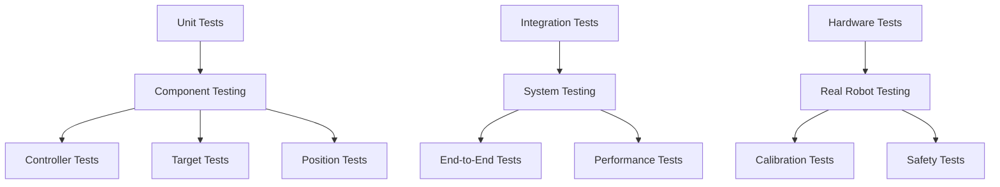
```mermaid
graph TD
    A[Unit Tests] --> B[Component Testing]
    C[Integration Tests] --> D[System Testing]
    E[Hardware Tests] --> F[Real Robot Testing]
    
    B --> G[Controller Tests]
    B --> H[Target Tests]
    B --> I[Position Tests]
    
    D --> J[End-to-End Tests]
    D --> K[Performance Tests]
    
    F --> L[Calibration Tests]
    F --> M[Safety Tests]
```

## Key Features Summary

### Core Capabilities
- **Differential Drive Control**: Precise control of left and right motors
- **Position Tracking**: Real-time 2D position and orientation tracking
- **Motion Planning**: Support for position, angle, distance, and curve targets
- **PID Control**: Multiple PID controllers for different motion types
- **Speed Profiling**: Smooth acceleration and deceleration ramps
- **Multi-threading**: Concurrent task execution and management
- **Configuration Management**: JSON-based parameter storage and loading
- **Communication**: Network and serial communication interfaces
- **Calibration**: Comprehensive system calibration procedures
- **Safety**: Built-in error handling and safety features

### Advanced Features
- **Kalman Filtering**: State estimation for improved position tracking
- **Curve Following**: Support for complex path following
- **Extremum Seeking**: Advanced PID tuning algorithms
- **Task Scheduling**: Sophisticated task management system
- **Packet Communication**: Structured network communication
- **AX12 Servo Control**: Integration with AX12 servo motors
- **Thread-Safe Operations**: Concurrent access protection
- **Event-Driven Architecture**: Callback-based event handling

This architecture provides a robust, scalable, and maintainable foundation for robot control applications, with clear separation of concerns and well-defined interfaces between components. 