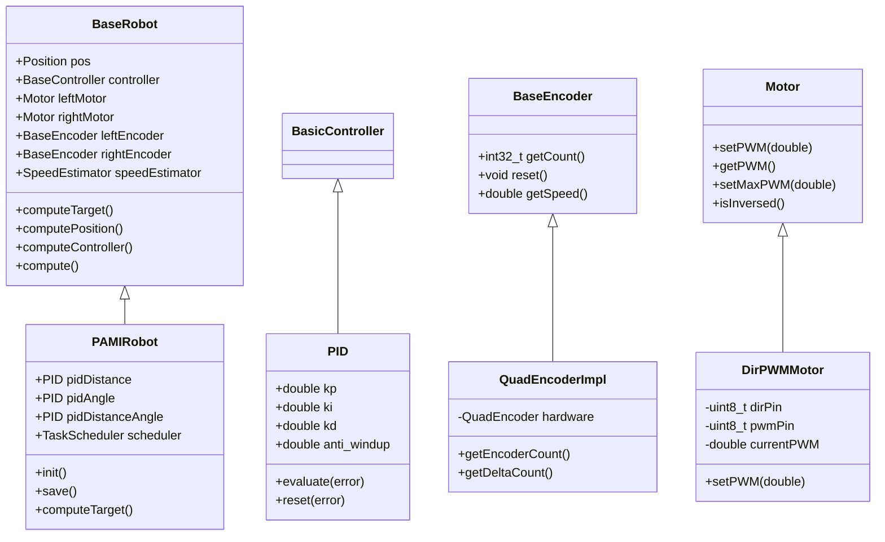
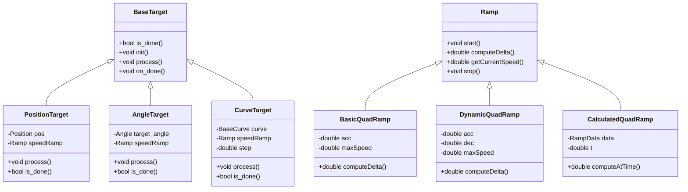
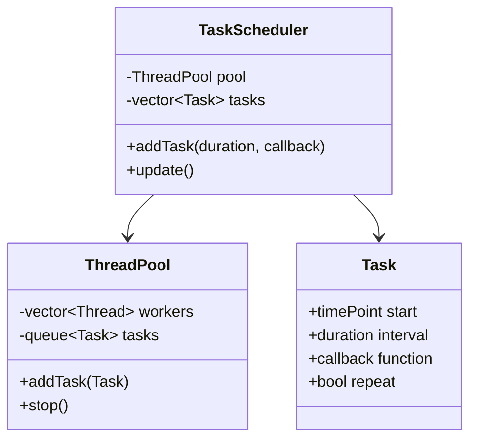
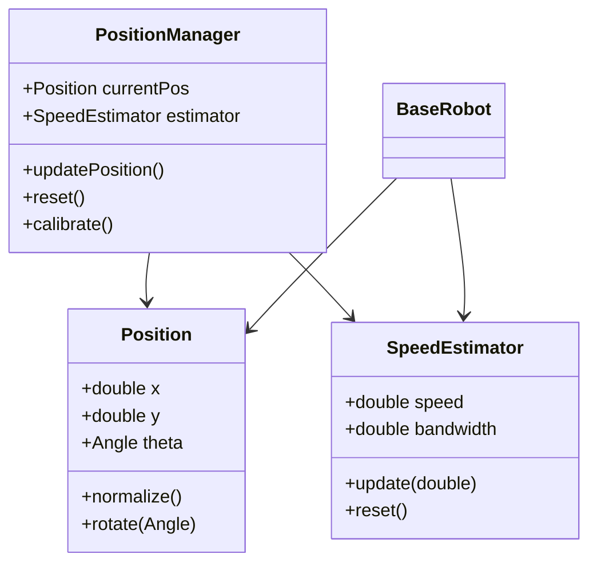
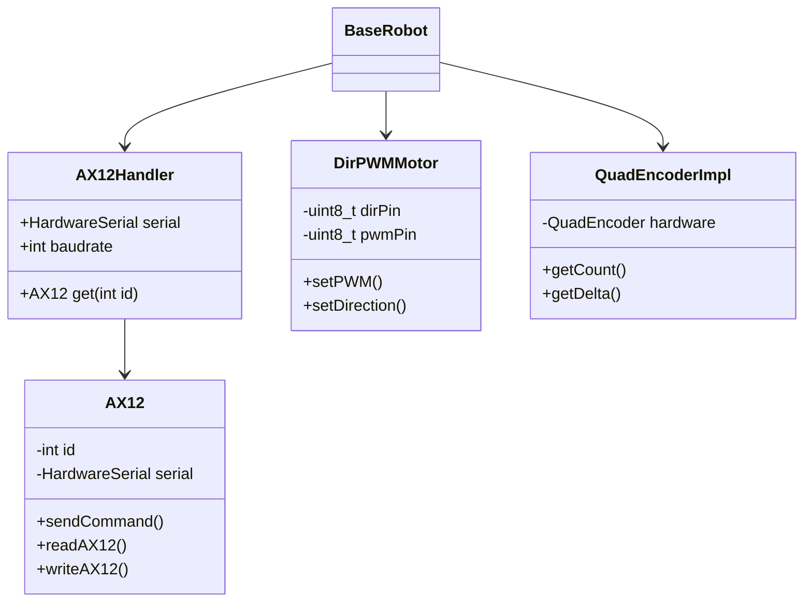
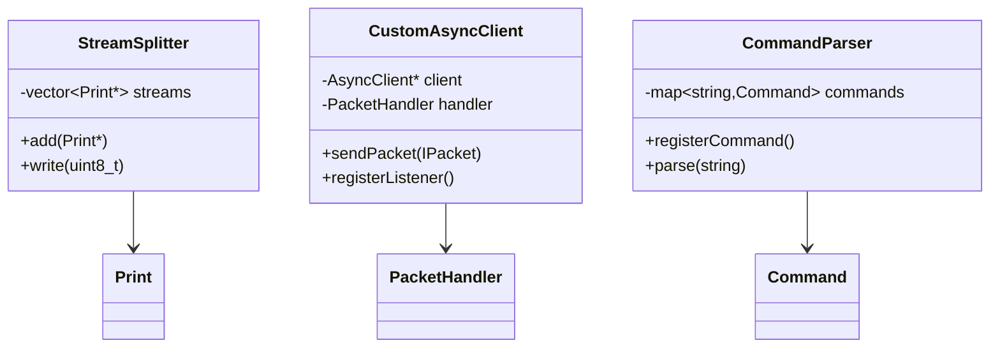
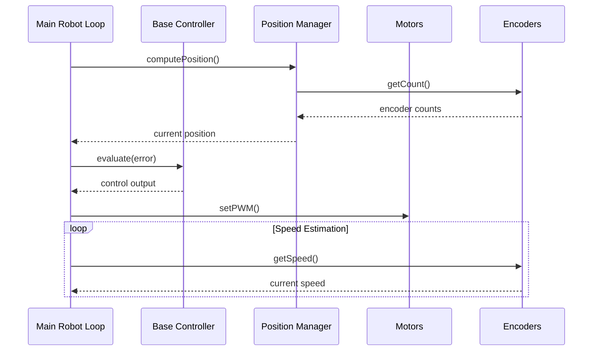
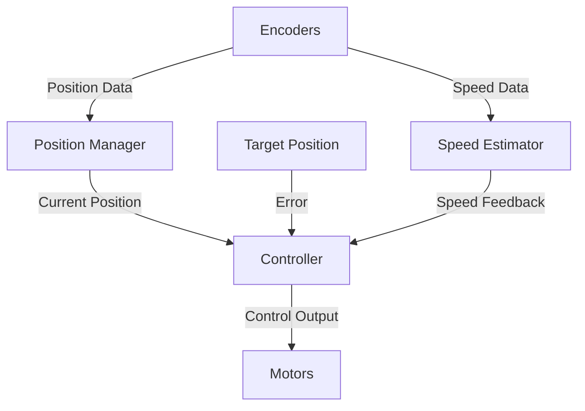

 # PAMITeensy System Architecture

## Class Hierarchy

### Core Components

### Motion Control

### Task Management

### Position Management

### Hardware Control

### Communication

## Component Interactions

### Control Flow

### Data Flow

## System Components

### 1. Robot Control
The robot control system is built around the `BaseRobot` class hierarchy:
- Position tracking and management
- Motor control interface
- Encoder integration
- Motion control algorithms
- Target management

### 2. Motion Control
The motion control system includes:
- PID controller implementation
- Speed estimation
- Position management
- Target tracking
- Speed ramping profiles
- Curve following
- Position and angle targets

### 3. Hardware Interface
Hardware abstraction layers for:
- Motor control (PWM and direction)
- Encoder reading
- AX12 servo communication
- Serial communication
- Network communication

### 4. Position Management
Position tracking system features:
- 2D position tracking (X, Y coordinates)
- Angular position management
- Speed estimation
- Encoder-based positioning
- Position calibration
- Parameter estimation

### 5. Task Management
Task scheduling and execution:
- Thread pool management
- Task scheduling
- Periodic task execution
- Resource management
- Command processing

### 6. Configuration Management
The system supports:
- JSON-based configuration
- Parameter persistence
- Runtime parameter adjustment
- Command-line interface
- Network configuration

### 7. Communication
Communication interfaces include:
- Serial communication
- Network communication
- Command parsing
- Status reporting
- Stream management
- Error handling 