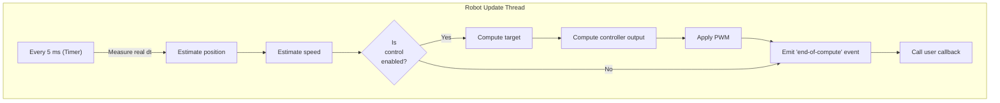
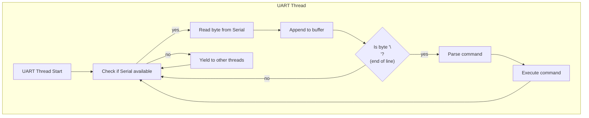
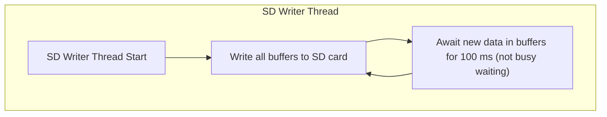
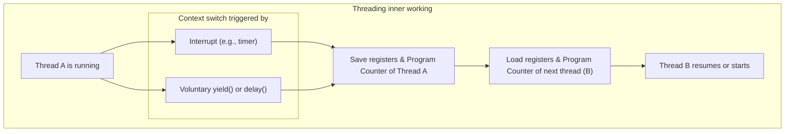

```mermaid
flowchart TD
    subgraph RobotUpdateThread[Robot Update Thread]
        RU0["Every 5 ms (Timer)"]
        RU1["Estimate position"]
        RU2["Estimate speed"]
        RU3{"Is<br/>control<br/>enabled?"}
        RU4["Compute target"]
        RU5["Compute controller output"]
        ApplyPWM["Apply PWM"]
        RU6["Emit 'end-of-compute' event"]
        RU7["Call user callback"]

        RU0 -->|"Measure real dt"| RU1 --> RU2 --> RU3
        RU3 -->|Yes| RU4 --> RU5 --> ApplyPWM --> RU6 --> RU7
        RU3 -->|No| RU6
    end
```

```mermaid
flowchart TD
    subgraph UARTThread[UART Thread]
        Start[UART Thread Start]
        Check["Check if Serial available"]
        Read["Read byte from Serial"]
        Append["Append to buffer"]
        IfNewline{"Is byte '\\n'?<br/>(end of line)"}
        Parse["Parse command"]
        Execute["Execute command"]
        Yield["Yield to other threads"]

        Start --> Check
        Check -->|yes| Read --> Append --> IfNewline
        IfNewline -- yes --> Parse --> Execute
        IfNewline -- no --> Check
        Execute --> Check
        Check -->|no| Yield --> Check
    end
```

```mermaid
flowchart TD
    subgraph SDWRITERThread[SD Writer Thread]
        SD0["SD Writer Thread Start"]
        SD2["Write all buffers to SD card"]
        SD3["Await new data in buffers for 100 ms (not busy waiting)"]

        SD0 --> SD2 --> SD3 --> SD2 
    end
```

```mermaid
flowchart TD
    subgraph Threading["Threading inner working"]
        A[Thread A is running]

        subgraph Context switch triggered by
            direction TB
            Trigger1["Interrupt (e.g., timer)"]
            Trigger2["Voluntary yield() or delay()"]
        end

        Save["Save registers & Program Counter of Thread A"]
        Load["Load registers & Program Counter of next thread (B)"]
        B[Thread B resumes or starts]

        A --> Trigger1
        A --> Trigger2
        Trigger1 --> Save
        Trigger2 --> Save
        Save --> Load --> B

    end
```