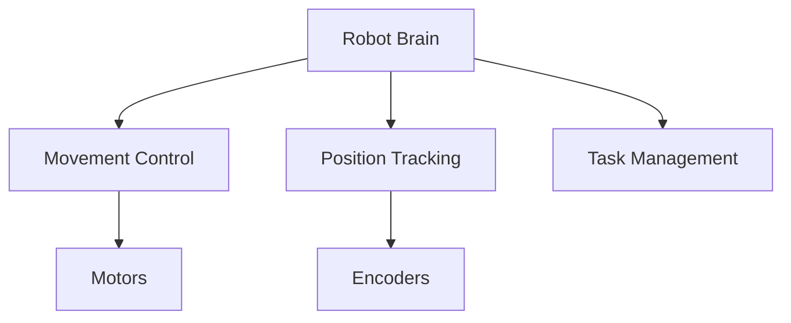
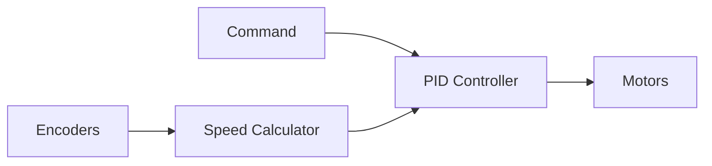
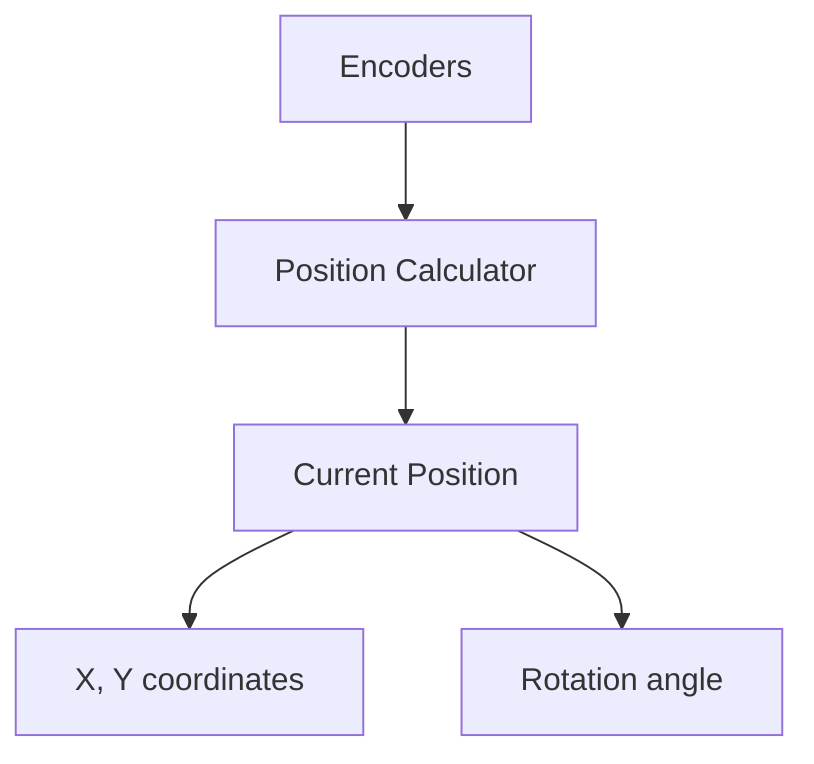
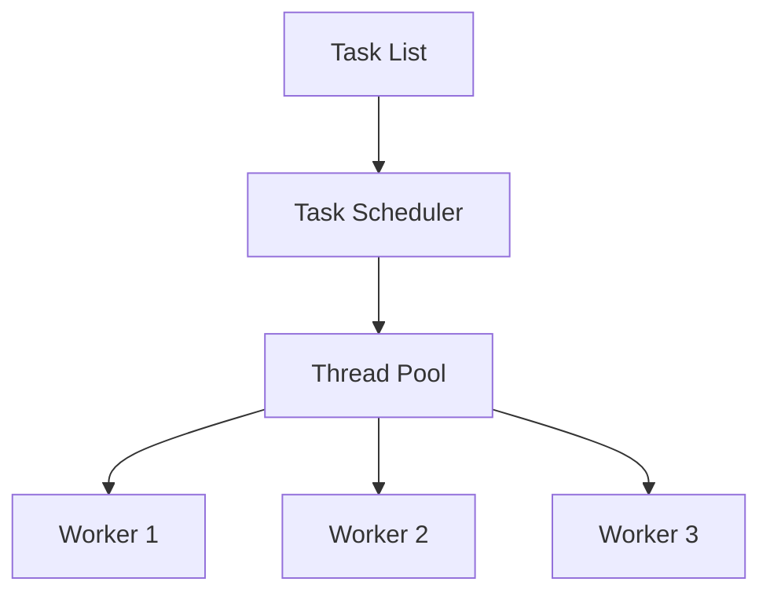
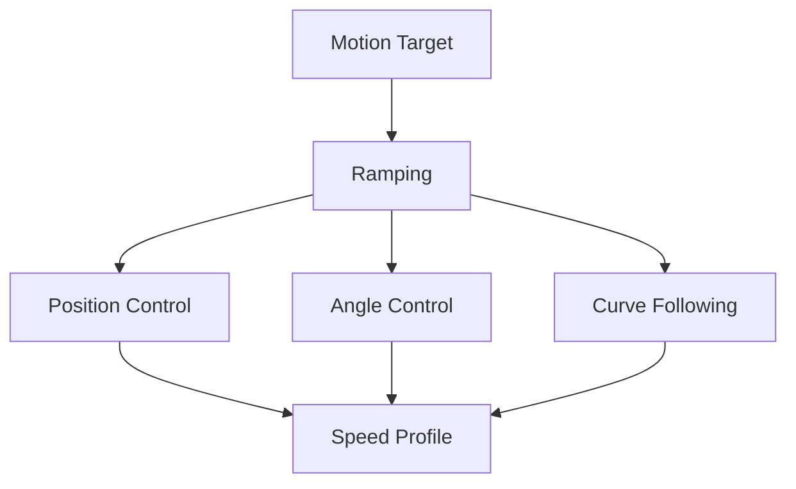
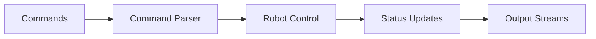

# PAMITeensy Robot Control System - Simplified Architecture

## What is PAMITeensy?

PAMITeensy is a robot control system that runs on Teensy microcontrollers. Think of it as the "brain" of a robot that:
- Controls how the robot moves
- Keeps track of where the robot is
- Makes sure the robot follows commands accurately
- Can handle multiple tasks at once

## Main Components

### 1. Robot Control (PAMIRobot)


The robot's main control system:
- Takes commands like "move forward" or "turn left"
- Makes sure the robot moves smoothly and accurately
- Keeps track of where the robot is
- Can handle multiple commands in sequence

### 2. Movement System


How the robot moves:
- Motors: Make the robot move (like your legs)
- Encoders: Measure how far the wheels have turned (like counting steps)
- PID Controllers: Make sure the movement is smooth and accurate (like your balance system)
- Speed Calculator: Figures out how fast the robot is moving

### 3. Position Tracking


How the robot knows where it is:
- Uses wheel encoders to measure movement
- Calculates position in 2D space (X, Y coordinates)
- Keeps track of which way the robot is facing
- Updates position at 200 Hz

### 4. Task Management


How the robot handles multiple tasks:
- Can store a list of commands to execute
- Runs different tasks at the same time
- Makes sure everything happens in the right order
- Manages system resources efficiently

### 5. Motion Control


How the robot controls motion:
- Ramping: Smooth acceleration and deceleration
- Position Control: Moving to specific locations
- Angle Control: Rotating to specific angles
- Curve Following: Following complex paths
- Speed Profiles: Optimizing movement speed

### 6. Communication


How the robot communicates:
- Command Parsing: Interpreting user commands
- Status Updates: Reporting robot state
- Stream Management: Handling multiple outputs
- Error Reporting: Providing feedback

## How It All Works Together

1. **Command Phase**
   - Robot receives a command (e.g., "move forward 1 meter")
   - Command is added to the task list

2. **Planning Phase**
   - System calculates required motor speeds
   - Plans the movement path
   - Generates speed profiles

3. **Execution Phase**
   - Motors start moving
   - PID controllers ensure smooth motion
   - Encoders measure actual movement
   - Position is constantly updated

4. **Feedback Loop**
   - System checks if movement is correct
   - Adjusts motor speeds if needed
   - Updates position tracking
   - Moves to next command when ready

## Configuration

The robot can be configured through JSON files:
```json
{
    "motors": {
        "max_speed": 1.0,
        "acceleration": 0.5
    },
    "pid": {
        "position": {
            "kp": 1.0,
            "ki": 0.1,
            "kd": 0.05
        }
    },
    "motion": {
        "ramping": {
            "acceleration": 0.5,
            "max_speed": 1.0
        }
    }
}
```

## Safety Features

The system includes:
- Motor speed limits
- Acceleration control
- Error detection
- Emergency stop capability
- Position bounds checking
- Command validation

## Example Usage

```cpp
// Create a new robot
auto robot = std::make_shared<PAMIRobot>();

// Initialize systems
robot->init();

// Add movement commands
robot->addTarget(std::make_shared<MoveForward>(1.0));  // Move forward 1 meter
robot->addTarget(std::make_shared<Turn>(90));          // Turn 90 degrees

// Add curve following
auto curve = std::make_shared<CircleCurve>(1.0);       // 1 meter radius
robot->addTarget(std::make_shared<CurveTarget>(curve));
```

## Real-World Comparison

Think of the robot control system like driving a car:
- Motors = Engine
- Encoders = Odometer
- PID Controllers = Cruise Control
- Position Tracking = GPS
- Task Scheduler = Your Brain (planning the route)
- Motion Profiles = Driving Style (smooth vs. sporty)

## Key Benefits

1. **Accuracy**: Precise movement and position tracking
2. **Flexibility**: Can handle many different types of commands
3. **Reliability**: Built-in error checking and correction
4. **Efficiency**: Can do multiple things at once
5. **Configurability**: Easy to adjust for different robots
6. **Extensibility**: Easy to add new motion types

## Common Use Cases

1. **Navigation**
   - Moving to specific locations
   - Following paths
   - Avoiding obstacles
   - Following curves and complex trajectories

2. **Task Automation**
   - Repeating sequences of movements
   - Responding to sensors
   - Coordinating with other systems
   - Managing multiple concurrent tasks

3. **Data Collection**
   - Tracking movement patterns
   - Measuring performance
   - Logging system status 